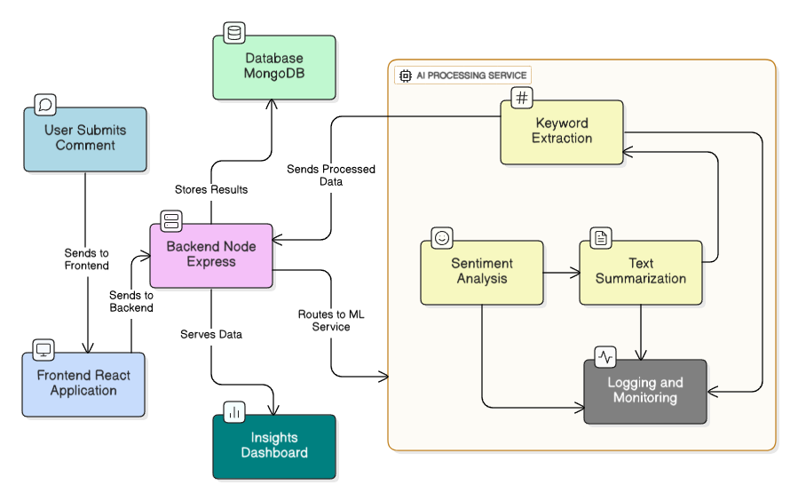

# S.A.R.A - Sentiment Analysis & Reporting Assistant
*AI-powered assistant for analyzing stakeholder feedback at scale*

---

## 📌 Overview
S.A.R.A (Sentiment Analysis & Reporting Assistant) is an AI-powered tool designed to streamline the **analysis of stakeholder feedback** collected via the MCA eConsultation module.  
It helps policymakers and analysts make sense of **thousands to millions of comments** by automatically classifying sentiments, generating summaries, and visualizing keyword trends.  

---

## ✨ Features
- 🔍 **Sentiment Analysis** – Classifies comments as Positive, Negative, or Neutral with an overall sentiment score.  
- 📝 **Summary Generation** – Produces concise, meaningful summaries for quick understanding.  
- ☁️ **Word Cloud Visualization** – Highlights frequent keywords and recurring stakeholder concerns.  
- ⚡ **Automated Insights** – Converts unstructured feedback into structured outputs.  
- 🎯 **Domain-Specific Accuracy** – Fine-tuned NLP models for legal and policy language.  

---

## ⚙️ How It Works

1. 📤 **Upload CSV File** – Users upload stakeholder comments in `.csv` format.  
2. 🤖 **AI Processing** – Our NLP models analyze each comment:
   - Sentiment classification (Positive / Negative / Neutral)  
   - Summary generation  
   - Keyword extraction  
3. 📊 **Visualization** – Insights are presented through:
   - Sentiment distribution charts  
   - Word cloud highlighting frequent terms  
   - Auto-generated summaries for quick review  
4. ✅ **Actionable Output** – Analysts can quickly identify support, concerns, and recurring themes.

---

## 📌 *Architecture Diagram*

  

---

## 🛠️ Tech Stack
- 🎨 **Frontend** – React.js + Tailwind CSS (for responsive UI)  
- ⚙️ **Backend** – Node.js + Express.js (REST APIs)  
- 🗄️ **Database** – MongoDB (for storing comments & results)  
- 🤖 **AI / NLP** – (Pluggable) Python-based models for sentiment analysis & summarization  
- ☁️ **Deployment** – Designed for scalable cloud integration  

---

## 🌍 Impact & Benefits
- ⏳ **Time-Saving** – Reduces weeks of manual review to just minutes.  
- 🧐 **Comprehensive Analysis** – Ensures no stakeholder comment is overlooked.  
- 📈 **Better Decision-Making** – Provides clear, structured insights for policymakers.  
- 🤝 **Transparency & Trust** – Every citizen’s feedback is heard, strengthening participatory governance.  
- 🚀 **Scalable** – Can handle thousands to millions of comments with ease.  

---

## 👥 Team
Built with ❤️ by **The Insight Crew**  

*Smart India Hackathon 2025 – Internal Round*  

